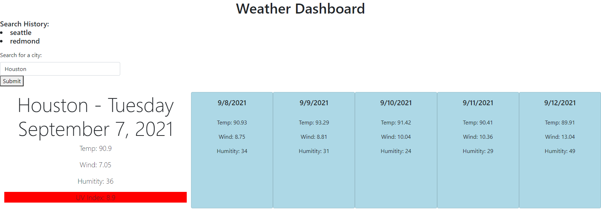

# Weather-Dashboard

# HTML, CSS, JS 

**Author**: Charles Glass
**Version**: 1.0.0

## Deployed Site
https://glasscharlie.github.io/Weather-Dashboard/

## Images

## User Story
AS A traveler
I WANT to see the weather outlook for multiple cities
SO THAT I can plan a trip accordingly

## Architecture
This application is written in HTML, CSS, and JS
It utilizes the Moment.js library, and Bootstrap

## Change Log
7-1-2021 3:30pm - Added base code \
7-1-2021 6:40pm - Added JS functionality
9-7-2021 1:00pm - Fixed API call to work on HTTPS

-->
